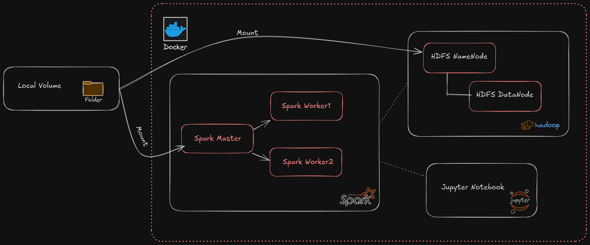

# Spark & HDFS Cluster Setup for Machine Learning Training
This guide provides detailed steps to set up a Spark and HDFS cluster using Docker and Docker Compose. The setup includes loading data into HDFS and running simple PySpark applications for machine learning.

## Prerequisites
Before you begin, ensure that you have the following installed:

 * [Docker](https://docs.docker.com/get-started/get-docker/): Make sure Docker is installed and running on your machine.
 * [Docker Compose](https://docs.docker.com/compose/install/): This is required to run the multi-container setup.

## Step 1: Clone the Repository
Clone the repository to your local machine:

```bash
git clone git@github.com:same-ou/spark-hdfs-ml.git
cd spark-hdfs-ml 
```
## Step 2: Set Up Docker Containers with Docker Compose
This project uses Docker Compose to set up the Spark Master, Spark Worker, HDFS (NameNode and DataNode) containers. To start the containers, follow these steps:

1. Start Docker Compose:

    From the project root, run the following command to start the cluster:

    ```bash
        docker-compose up -d
    ```
This command will automatically start the containers for the Spark Master, Spark Worker, HDFS NameNode, and HDFS DataNode.

2. Verify the Containers:

    Check if the containers are running:

    ```bash
        docker ps
    ```

You should see containers for `spark-master`, `spark-worker-1`, `spark-worker-2`, `namenode`, `datanode`, and `hue`.

## Step 3: Cluster Architecture
Below is a diagram of the architecture for this Spark and HDFS cluster setup.




Spark Master: The central controller node that manages the cluster and schedules tasks.
Spark Worker: The worker nodes that execute the tasks.
HDFS NameNode: The master server that manages the filesystem metadata.
HDFS DataNode: The worker nodes that store the actual data in HDFS.

## Step 4: Load Data into HDFS

In order to load data into HDFS, we need to have the data available inside the `namenode` container. One way to do this is by using the `docker cp` command, which copies files or directories between the host machine and a container. The command would look like this:

```bash
docker cp /path/to/your/data/data.csv namenode:/tmp/data/
```
However, we are using a simpler and more efficient approach. The data folder in the main project folder is mounted to a specific folder on the `namenode` container. You can verify this by running the following command inside the namenode container

```bash
docker exec -it namenode ls /tmp/data 
```
This will show the contents of the /tmp/data directory inside the namenode container. As the data folder in the main project folder is automatically mounted to the container's volume, any files placed in the data folder on the host machine will be automatically available inside the container.

Simply add your data file to the data folder in the project directory, and it will be automatically mounted to the container's `/tmp/data/` directory.

### Copy the Data to HDFS
After you verify that the data is correctly mounted, you can proceed to upload the data into HDFS:

1. Create a directory in HDFS to store the CSV file:

```bash
docker exec -it namenode hdfs dfs -mkdir -p /user/data  
```
2. Upload the CSV file (e.g., tweets.csv) from the mounted /tmp/data folder into the newly created HDFS directory:

```bash
docker exec -it namenode hdfs dfs -put /tmp/data/tweets.csv /user/data/
```

3. Verify that the file was uploaded successfully:

```bash
docker exec -it namenode hdfs dfs -ls /user/data   
```

You should see tweets.csv listed in the output.

Additionally, you can verify the file upload using Hue. Hue is a web interface that allows you to interact with HDFS. To use it:

1. Open your browser and navigate to http://localhost:8000.
2. Log in with the default credentials (If this is your first time logging in, you will be asked to create an account).
3. Go to the File Browser section and navigate to /user/data/.
4. You should see tweets.csv listed in the directory.

## Step 5: Process Data Using PySpark

Now that the data is loaded into HDFS, you can use the PySpark application to process it.

1. **Create your application in the `apps` folder**, which is mounted to the `spark-master` container. You can write your PySpark code, for example, `read_hdfs.py` (or any other script), to process the data.

2. **Run the application** by executing the following command from your local machine:

```bash
docker exec -it spark-master \
    /opt/bitnami/spark/bin/spark-submit \
    --master spark://spark-master:7077 \
    /opt/bitnami/spark/work/read_hdfs.py
```
